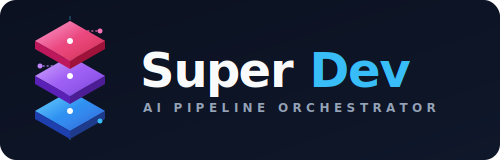
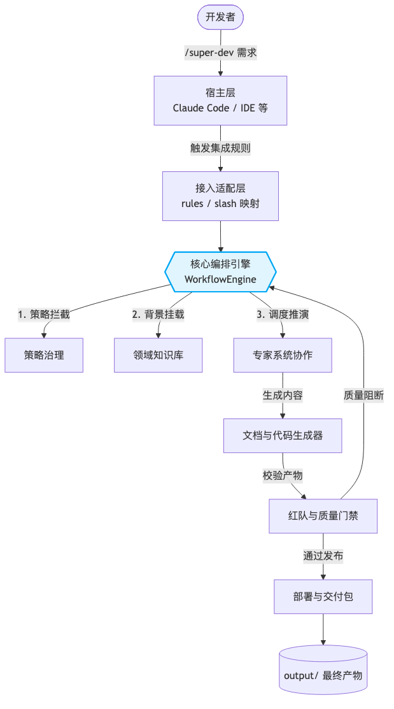
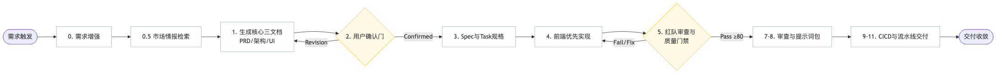
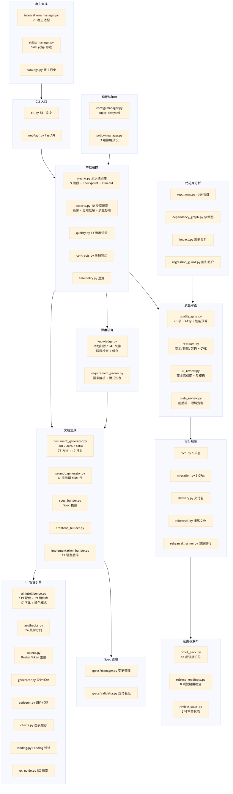

# Super Dev

<div align="center">



### 面向商业级交付的 AI 开发编排工具

[](LICENSE)
[](https://www.python.org/downloads/)
[](https://mypy-lang.org/)
[](https://docs.astral.sh/ruff/)

[English](README_EN.md) | 简体中文

</div>

---

## 版本

当前版本：`2.0.11`

---

## 演示视频

<video controls playsinline preload="metadata" src="https://shangyankeji.github.io/super-dev/demo.mp4" width="100%"></video>

- 在线播放：[观看演示视频](https://shangyankeji.github.io/super-dev/demo.mp4)
- 仓库文件：[demo.mp4](demo.mp4)

---

## 项目介绍

`Super Dev` 是一个面向商业级交付的 AI 开发编排工具，用于把宿主里的模型能力组织成一套稳定、清晰、可审计的工程流水线。

产品定位：

- 宿主负责模型调用、联网搜索、代码产出、终端执行与文件修改
- `Super Dev` 负责流程治理、设计约束、质量门禁、审计产物与交付标准

它解决的是交付过程问题：

- 将需求沉淀为可落地工件：PRD、架构、UI/UX、Spec、任务清单与交付清单
- 将开发过程组织为标准化流水线：可追踪、可恢复、可审计、可复盘
- 将质量控制前置到每个阶段：策略治理、红队审查、质量门禁、发布演练
- 将多宿主协作统一到同一套工程规范：CLI 与 IDE 环境共享同一交付标准

---

## 核心功能

### 1. 宿主接入治理

- 支持主流 CLI/IDE 宿主统一接入
- 自动生成宿主规则文件、`/super-dev` 映射、Skill 目录
- `detect/onboard/doctor/setup/install` 形成接入闭环
- 通过宿主能力边界建模，明确哪些宿主是 `Certified / Compatible / Experimental`

### 2. 流水线式开发编排（0-12 阶段）

- 同类产品研究 -> 需求增强 -> 文档 -> Spec -> 实现骨架 -> 红队 -> 质量门禁 -> 交付
- 全流程可恢复执行（`run --resume`）
- UI 不满意时可发起正式改版回路（`review ui`）
- 适配 0-1 新建与 1-N+1 增量场景

### 3. 策略治理（Policy DSL）

- `default / balanced / enterprise` 预设
- 强制红队/质量门禁
- 最低质量阈值、CI/CD 白名单
- required hosts 与 ready+score 硬校验

### 4. 宿主画像与兼容性门禁

- 自动探测宿主并评分
- 输出 `host-compatibility` 报告与历史
- `--save-profile` 写入 `super-dev.yaml` 并用于质量门禁
- `integrate validate` 汇总宿主前置条件、运行时验收状态和交付就绪建议

### 5. 代码库理解与变更分析

- `repo-map` 生成代码库地图与建议阅读顺序
- `dependency-graph` 输出模块依赖关系与关键路径
- `impact` 分析改动影响范围、风险等级和建议动作
- `regression-guard` 把影响分析转换成可执行回归清单

### 6. 可审计交付

- `pipeline-metrics` 指标报告
- `pipeline-contract` 阶段契约证据
- `resume-audit` 恢复执行审计
- `delivery manifest/report/archive` 交付包
- `proof-pack` 交付证据汇总与 executive summary
- `release readiness` 与 `Spec Quality` 统一发布评分面板

### 7. 商业级门禁链路

- 红队审查（安全/性能/架构）
- 质量门禁（场景阈值与策略阈值）
- 发布演练与回滚预案

### 8. 缺陷修复与返工回路

- `super-dev fix` 显式进入轻量 bugfix 路径
- 文档返工、UI 改版、架构返工、质量返工已正式纳入门禁
- 修复缺陷时仍保留文档、验证、质量和交付证据

### 9. 商业级 UI Intelligence

- 内置 UI/UX 知识库：产品类型、行业语气、信任模块、页面骨架、反模式、信息密度
- 内置主流组件生态推荐：React/Next、Vue、Angular、Svelte 等按宿主和场景输出首选与备选方案
- UI/UX 文档会自动给出组件生态、表单/表格/图表/动效/图标基线，直接约束实现阶段
- 宿主提示词与 Skill 会继承这些规则，输出更接近现代商业产品的界面结果
- 新增 `super-dev quality --type ui-review`，可对 `preview.html` / `output/frontend/index.html` 做结构级视觉审查

---

## 安装方式

### 1. uv 安装（推荐）

```bash
uv tool install super-dev
```

升级：

```bash
uv tool upgrade super-dev
super-dev update
```

### 2. PyPI 安装

```bash
pip install -U super-dev
super-dev update
```

安装完成后，直接运行：

```bash
super-dev
```

常用交付证据命令：

```bash
super-dev integrate audit --auto --repair --force
super-dev integrate harden --all --official-compare
super-dev integrate validate --auto
super-dev repo-map
super-dev dependency-graph
super-dev impact "修改登录流程" --files services/auth.py
super-dev regression-guard "修改登录流程" --files services/auth.py
super-dev fix "修复登录接口 500 并补充回归验证"
super-dev spec propose add-billing --title "..." --description "..." --no-scaffold
super-dev spec scaffold <change_id>
super-dev spec quality <change_id>
super-dev run --status
super-dev run --confirm docs --comment "三文档已确认"
super-dev release proof-pack
super-dev release readiness
super-dev review architecture --status revision_requested --comment "技术方案需要重构"
super-dev review quality --status revision_requested --comment "质量门禁未通过，需要整改"
```

默认会进入宿主安装引导：

- 顶部显示 `Super Dev` 安装入口
- `↑ / ↓` 选择宿主
- `Space` 勾选宿主
- `Enter` 开始安装
- `A` 全选
- `C` 仅选择 CLI 宿主
- `I` 仅选择 IDE 宿主
- `R` 清空选择

安装完成后，终端会直接给出该宿主的最终触发方式：

- slash 宿主：`/super-dev 你的需求`
- 非 slash 宿主：`super-dev: 你的需求`
- 需要真人验收时，可执行：`super-dev integrate validate --target <host>`
- `super-dev doctor --host <host>` / `integrate audit` / `integrate validate` 会显示宿主前置条件，例如宿主鉴权、重开会话、绑定目标项目/工作区。

如果你希望先显式初始化项目契约，再开始接入宿主：

```bash
super-dev bootstrap --name my-project --platform web --frontend next --backend node
```

`super-dev release proof-pack` 与 `super-dev release readiness` 现在会自动纳入当前有效 change 的 `Spec Quality` 评分，统一展示 proposal/spec/plan/tasks/checklist/validation 的交付成熟度。

这会显式生成：

- `.super-dev/WORKFLOW.md`
- `output/*-bootstrap.md`

用来固定初始化规范、触发方式和阶段顺序。

如果你需要跨阶段控制流程，也可以直接使用：

```bash
super-dev run --status
super-dev run --phase frontend
super-dev run --jump quality
super-dev run --confirm docs --comment "三文档已确认"
```

如果你需要把 Spec 生成、补全和质量评估拆开执行，也可以直接使用：

```bash
super-dev spec propose add-billing --title "..." --description "..." --no-scaffold
super-dev spec scaffold add-billing
super-dev spec quality add-billing
super-dev spec quality add-billing --json
```

### 3. 指定版本安装

```bash
pip install super-dev==2.0.11
```

### 4. GitHub 指定标签安装

```bash
pip install git+https://github.com/shangyankeji/super-dev.git@v2.0.11
```

### 5. 源码开发安装

`uv` 开发环境：

```bash
git clone https://github.com/shangyankeji/super-dev.git
cd super-dev
uv sync
uv run super-dev --version
```

`pip` 开发环境：

```bash
git clone https://github.com/shangyankeji/super-dev.git
cd super-dev
pip install -e ".[dev]"
```

---

## 依赖安装说明

当用户执行：

```bash
pip install -U super-dev
```

或：

```bash
uv tool install super-dev
```

安装器会自动安装 `pyproject.toml` 中声明的 Python 依赖，例如：

- `rich`
- `pyyaml`
- `ddgs`
- `requests`
- `beautifulsoup4`
- `fastapi`
- `uvicorn`

不会自动安装的内容：

- Claude Code / Codex CLI / Gemini CLI / Cursor / Trae / Windsurf 等宿主软件本身
- Node.js、npm、pnpm、Docker、数据库服务这类系统级运行环境
- 宿主账号登录状态、联网权限、浏览器能力
- 项目业务依赖以外的前后端运行时

一句话：

- `pip` / `uv` 会自动安装 **Super Dev 自己的 Python 依赖**
- 不会替用户安装 **宿主工具和系统环境**

---

## 整个系统如何工作

`Super Dev` 的运行方式可以概括为一条固定链路：

1. 用户在项目目录执行 `super-dev`
2. 安装引导把 Super Dev 接入到目标宿主
3. 用户在宿主里输入 `/super-dev 需求` 或 `super-dev: 需求`
4. 宿主进入 Super Dev 流水线
5. 宿主负责联网、推理、编码、运行与修改文件
6. Super Dev 负责流程、文档、门禁、审计和交付标准

补充说明：

- 新功能开发默认走完整流水线：`research -> 三文档 -> 用户确认 -> Spec / tasks -> 前端运行验证 -> 后端 / 测试 / 交付`
- 缺陷修复同样不会直接跳过文档；会走轻量补丁路径，先整理问题现象、复现条件、影响范围和回归风险，再更新补丁文档与验证结果
- 分析阶段默认排除 `.venv`、`site-packages`、`node_modules` 等非项目源码目录

---

## 关键文档

- [文档总览](docs/README.md)
- [快速开始](docs/QUICKSTART.md)
- [安装方式](docs/INSTALL_OPTIONS.md)
- [宿主使用指南](docs/HOST_USAGE_GUIDE.md)
- [宿主能力审计](docs/HOST_CAPABILITY_AUDIT.md)
- [工作流指南](docs/WORKFLOW_GUIDE.md)
- [集成指南](docs/INTEGRATION_GUIDE.md)

执行原则：

- 宿主负责“写代码”
- `Super Dev` 负责“把开发过程做对、做全、可审计”

### 一、系统高阶流转架构

展示用户、宿主端工具、Super Dev 编排引擎与最终产物之间的流转关系。



### 二、12 阶段核心工作流

详细描绘每次对话触发后，引擎在底层的流转经过。



### 三、核心模块调用拓扑

展示 `super_dev` 下核心源码目录的职责边界和调用关系。



---

## 最简单使用（给最终用户）

### CLI 宿主（Claude Code / Codex CLI / Gemini CLI / OpenCode / Kiro CLI / Cursor CLI / Qoder CLI / CodeBuddy CLI）

1. 进入项目目录执行 `super-dev` 完成接入。  
2. Claude Code / Gemini CLI / Kiro CLI / Cursor CLI / Qoder CLI / CodeBuddy CLI / OpenCode 等 slash 宿主，可直接输入：`/super-dev 你的需求`。
3. Codex CLI 当前不使用 `/super-dev`；在宿主会话里输入 `super-dev: 你的需求`。
4. 宿主会先被约束执行“同类产品研究 -> 三文档 -> 等待用户确认 -> Spec -> 前端运行验证 -> 后端/测试/交付”，不会直接跳到写代码。
5. 如果是缺陷修复，优先使用 `super-dev fix "缺陷描述"`，走轻量 bugfix 路径，而不是完整功能开发路径。
6. 接手已有项目或复杂仓库时，优先执行 `super-dev repo-map` 生成代码库地图，再让宿主进入开发。
7. 如果准备重构、改接口、修登录流或修改关键状态流，先执行 `super-dev impact "变更描述" --files ...` 评估影响范围，再动手。

### 宿主如何理解 Super Dev

- `Super Dev` 是当前项目里的本地 Python CLI 工具，加上宿主里的规则文件 / Skill / slash 映射。
- 宿主负责模型推理、联网搜索、编码、运行终端与修改文件。
- `Super Dev` 负责把宿主拉进固定流水线：research、三文档、确认门、Spec、前端优先、后端联调、质量门禁、交付审计。
- 当用户输入 `/super-dev 需求` 或 `super-dev: 需求` 时，宿主要切换到 Super Dev 流水线执行模式。
- 需要生成或刷新文档、Spec、质量报告、交付产物时，宿主应优先调用本地 `super-dev` CLI。
- 如果项目根目录存在 `knowledge/`，宿主必须优先读取与当前需求相关的知识文件。
- 如果已生成 `output/knowledge-cache/*-knowledge-bundle.json`，宿主必须把其中命中的本地知识、研究摘要和场景约束继承到三文档、Spec 和实现阶段。

### IDE 宿主（Antigravity / Cursor / Windsurf / Kiro / Qoder / CodeBuddy / Trae / VS Code Copilot）

1. 进入项目目录执行 `super-dev` 完成接入。  
2. 打开 IDE 的 Agent Chat 后，按宿主真实入口触发。  
3. 支持 slash 的 IDE 使用 `/super-dev 你的需求`；不支持 slash 的 IDE 使用 `super-dev: 你的需求`。
4. 非 slash 宿主会通过项目规则、AGENTS 或 Skill 进入同样的 research-first 流程。

当前版本默认主推 `16` 个宿主适配配置。完整矩阵与官方依据见：

- [HOST_CAPABILITY_AUDIT.md](/Users/weiyou/Documents/kaifa/super-dev/docs/HOST_CAPABILITY_AUDIT.md)
- [HOST_USAGE_GUIDE.md](/Users/weiyou/Documents/kaifa/super-dev/docs/HOST_USAGE_GUIDE.md)

### 每个宿主如何使用

#### 1. Claude Code

安装：
```bash
super-dev onboard --host claude-code --force --yes
```

触发位置：
在项目目录启动 Claude Code 当前会话后，直接在同一会话里触发。

触发命令：
```text
/super-dev 你的需求
```

接入后是否需要重启：否

补充说明：
1. 推荐作为首选 CLI 宿主。
2. 接入后可先执行 `super-dev doctor --host claude-code` 确认 slash 已生效。
3. Claude Code 官方已公开 `.claude/agents/` 与 `~/.claude/agents/`，Super Dev 会同步生成 `super-dev-core` subagent。

#### 2. CodeBuddy CLI

安装：
```bash
super-dev onboard --host codebuddy-cli --force --yes
```

触发位置：
在项目目录启动 CodeBuddy CLI 会话后触发。

触发命令：
```text
/super-dev 你的需求
```

接入后是否需要重启：否

补充说明：
1. 在当前 CLI 会话中直接输入即可。
2. 如果会话已提前打开，建议重新加载项目规则后再试。

#### 3. CodeBuddy IDE

安装：
```bash
super-dev onboard --host codebuddy --force --yes
```

触发位置：
打开 CodeBuddy IDE 的 Agent Chat，在项目上下文内触发。

触发命令：
```text
/super-dev 你的需求
```

接入后是否需要重启：否

补充说明：
1. 建议在项目级 Agent Chat 中使用，不要脱离项目上下文。
2. 先让宿主完成 research，再继续文档和编码。
3. 当前按 `.codebuddy/commands/` + `.codebuddy/agents/` + `.codebuddy/skills/` 接入。


#### 4. Cursor CLI

安装：
```bash
super-dev onboard --host cursor-cli --force --yes
```

触发位置：
在项目目录启动 Cursor CLI 当前会话后触发。

触发命令：
```text
/super-dev 你的需求
```

接入后是否需要重启：否

补充说明：
1. 适合终端内连续执行研究、文档和编码。
2. 若命令列表未刷新，可重开一次 Cursor CLI 会话。

#### 5. Cursor IDE

安装：
```bash
super-dev onboard --host cursor --force --yes
```

触发位置：
打开 Cursor 的 Agent Chat，并确保当前工作区就是目标项目。

触发命令：
```text
/super-dev 你的需求
```

接入后是否需要重启：否

补充说明：
1. 建议固定在同一个 Agent Chat 会话里完成整条流水线。
2. 如果项目规则没加载，先重新打开工作区或重新发起聊天。

#### 6. Antigravity

安装：
```bash
super-dev onboard --host antigravity --force --yes
```

触发位置：
打开 Antigravity 的 Agent Chat / Prompt 面板，并确保当前工作区就是目标项目。

触发命令：
```text
/super-dev 你的需求
```

接入后是否需要重启：是

补充说明：
1. Antigravity 当前按 `GEMINI.md + .agent/workflows + /super-dev` 模式接入。
2. 接入会写入项目级 `GEMINI.md`、`.gemini/commands/super-dev.md`、`.agent/workflows/super-dev.md`。
3. 同时会写入用户级 `~/.gemini/GEMINI.md`、`~/.gemini/commands/super-dev.md` 与 `~/.gemini/skills/super-dev-core/SKILL.md`。
4. 完成接入后请重开 Antigravity 或至少新开一个 Agent Chat，再输入 `/super-dev 你的需求`。

#### 7. Gemini CLI

安装：
```bash
super-dev onboard --host gemini-cli --force --yes
```

触发位置：
在项目目录启动 Gemini CLI 会话后触发。

触发命令：
```text
/super-dev 你的需求
```

接入后是否需要重启：否

补充说明：
1. 优先在同一会话中完成 research -> 三文档 -> 用户确认 -> Spec -> 前端运行验证 -> 后端/交付。
2. 若宿主支持联网，先让它完成同类产品研究。

#### 8. Kiro CLI

安装：
```bash
super-dev onboard --host kiro-cli --force --yes
```

触发位置：
在项目目录启动 Kiro CLI 会话后触发。

触发命令：
```text
/super-dev 你的需求
```

接入后是否需要重启：否

补充说明：
1. CLI 模式下直接使用 slash。
2. 如果项目规则未刷新，重新进入项目目录再启动 Kiro CLI。

#### 9. Kiro IDE

安装：
```bash
super-dev onboard --host kiro --force --yes
```

触发位置：
打开 Kiro IDE 的 Agent Chat / AI 面板，在项目上下文内触发。

触发命令：
```text
super-dev: 你的需求
```

接入后是否需要重启：否

补充说明：
1. Kiro IDE 当前使用 steering/rules 模式，触发词为 `super-dev: 你的需求`。
2. 接入会写入项目级 `.kiro/steering/super-dev.md`，并补充官方全局 steering `~/.kiro/steering/AGENTS.md`。
3. 如果 steering/rules 未加载，先重开项目窗口。

#### 10. OpenCode

安装：
```bash
super-dev onboard --host opencode --force --yes
```

触发位置：
在项目目录启动 OpenCode CLI 会话后触发。

触发命令：
```text
/super-dev 你的需求
```

接入后是否需要重启：否

补充说明：
1. 按 CLI slash 模式使用。
2. 若你使用全局命令目录，也建议保留项目级接入文件。

#### 11. Qoder CLI

安装：
```bash
super-dev onboard --host qoder-cli --force --yes
```

触发位置：
在项目目录启动 Qoder CLI 会话后触发。

触发命令：
```text
/super-dev 你的需求
```

接入后是否需要重启：否

补充说明：
1. 适合命令行流水线开发。
2. 若 slash 未生效，先确认 `.qoder/commands/super-dev.md` 已生成。

#### 12. Qoder IDE

安装：
```bash
super-dev onboard --host qoder --force --yes
```

触发位置：
打开 Qoder IDE 的 Agent Chat，在当前项目内触发。

触发命令：
```text
/super-dev 你的需求
```

接入后是否需要重启：否

补充说明：
1. Qoder IDE 当前优先使用项目级 commands + rules 模式，直接在 Agent Chat 输入 `/super-dev 你的需求`。
2. 若新增命令未出现，先确认 `.qoder/commands/super-dev.md` 已生成，再重新打开项目或新开一个 Agent Chat。

#### 13. Windsurf

安装：
```bash
super-dev onboard --host windsurf --force --yes
```

触发位置：
打开 Windsurf 的 Agent Chat / Workflow 入口，在项目上下文内触发。

触发命令：
```text
/super-dev 你的需求
```

接入后是否需要重启：否

补充说明：
1. 当前按 IDE slash/workflow 模式适配。
2. 更适合在同一个 Workflow 里连续完成研究、文档、Spec 和编码。

#### 14. Codex CLI

安装：
```bash
super-dev onboard --host codex-cli --force --yes
```

触发位置：
在项目目录完成接入后，重启 `codex`，然后在新的 Codex 会话里触发。

触发命令：
```text
super-dev: 你的需求
```

接入后是否需要重启：是

补充说明：
1. Codex CLI 当前使用 `super-dev: 你的需求` 作为主触发方式。
2. 实际依赖 `AGENTS.md` 与官方用户级 Skill `~/.codex/skills/super-dev-core/SKILL.md`。
3. 如果旧会话没加载新 Skill，重启 `codex` 再试。

#### 15. Trae

安装：
```bash
super-dev onboard --host trae --force --yes
```

触发位置：
打开 Trae IDE 的 Agent Chat，在当前项目上下文内直接触发。

触发命令：
```text
super-dev: 你的需求
```

接入后是否需要重启：否

补充说明：
1. Trae 当前使用 `super-dev: 你的需求` 作为主触发方式。
2. 接入一定会写入项目级 `.trae/project_rules.md`、`.trae/rules.md` 和用户级 `~/.trae/user_rules.md`、`~/.trae/rules.md`；如果检测到兼容技能目录，也会增强安装 `~/.trae/skills/super-dev-core/SKILL.md`。
3. 完成接入后建议重开 Trae 或至少新开一个 Agent Chat，使规则生效；如果兼容 Skill 已安装，也会一起生效。
4. 随后按 `output/*` 与 `.super-dev/changes/*/tasks.md` 推进开发。

#### 16. VS Code Copilot

安装：
```bash
super-dev onboard --host vscode-copilot --force --yes
```

触发位置：
打开 VS Code 的 Copilot Chat，并确保当前工作区就是目标项目。

触发命令：
```text
super-dev: 你的需求
```

接入后是否需要重启：否

补充说明：
1. VS Code Copilot 当前按 `.github/copilot-instructions.md` + `AGENTS.md` 作为主接入面。
2. 不使用 `/super-dev`，直接在 Copilot Chat 输入 `super-dev:` 或 `super-dev：`。
3. 如果当前聊天没有读到新规则，先重开工作区或新开一个 Copilot Chat 会话。
