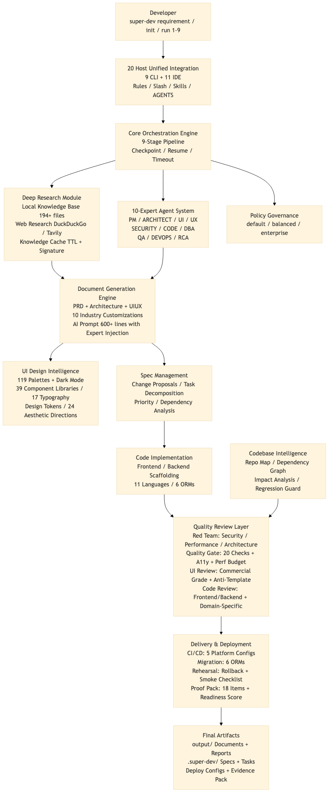
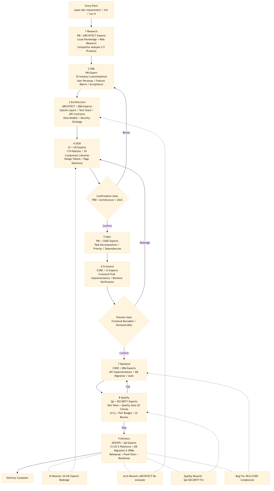
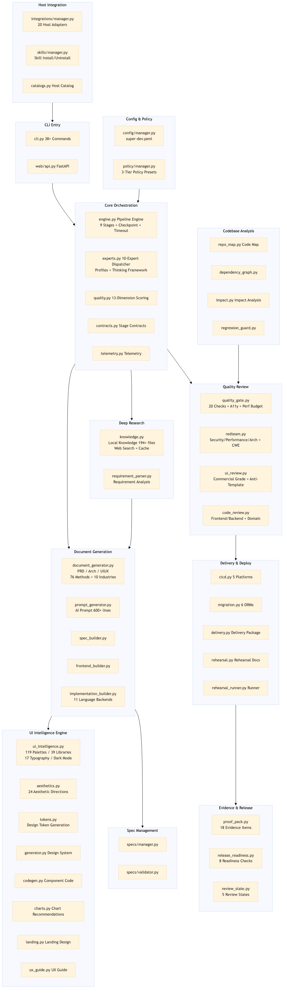

# Super Dev

<div align="center">


### AI Pipeline Orchestrator for Commercial-Grade Delivery

[](LICENSE)
[](https://www.python.org/downloads/)
[](https://mypy-lang.org/)
[](https://docs.astral.sh/ruff/)

[简体中文](README.md) | English

</div>

---

## Version

Current version: `2.1.0`

---

## Demo Video

<video controls playsinline preload="metadata" src="https://shangyankeji.github.io/super-dev/demo.mp4" width="100%"></video>

- Stream online: [Watch the demo](https://shangyankeji.github.io/super-dev/demo.mp4)
- Repository file: [demo.mp4](demo.mp4)

---

## What is Super Dev

`Super Dev` is an AI pipeline orchestrator for commercial-grade delivery. It organizes the model capabilities inside your host into a stable, transparent, and auditable engineering pipeline.

**Division of responsibility:**

- The host handles model inference, web research, code generation, terminal execution, and file modifications.
- `Super Dev` handles workflow governance, design constraints, quality gates, audit artifacts, and delivery standards.

**Problems it solves:**

- Converts requirements into production artifacts: PRD, architecture, UI/UX spec, task plans, and delivery manifests.
- Organizes development into a standardized pipeline: traceable, resumable, auditable, and reviewable.
- Enforces quality at every stage: policy governance, red-team review, quality gates, and release rehearsals.
- Unifies collaboration across 20 CLI and IDE hosts under one delivery standard.

---

## Quick Start

Three commands cover every scenario:

```bash
# Greenfield (0 to 1): run the full pipeline from a requirement description
super-dev "Build an online education platform"

# Existing codebase (1 to N+1): analyze the current repo then join the pipeline
super-dev init

# Jump to any stage / resume from interruption / check status
super-dev run frontend       # jump by name
super-dev run 6              # jump by number (1-9)
super-dev run --resume       # resume from last checkpoint
super-dev run --status       # view current pipeline state
```

Stage reference table:

| Number | Stage | Description |
|--------|-------|-------------|
| 1 | research | Competitor and market research |
| 2 | prd | Product requirements document |
| 3 | architecture | Architecture design |
| 4 | uiux | UI/UX design |
| 5 | spec | Task specification |
| 6 | frontend | Frontend implementation |
| 7 | backend | Backend implementation |
| 8 | quality | Quality gates |
| 9 | delivery | Delivery packaging |

Auxiliary commands:

```bash
super-dev onboard             # interactive host onboarding
super-dev onboard --dry-run   # preview changes without writing files
super-dev onboard --stable-only  # onboard certified hosts only
super-dev doctor              # diagnostics with certification grading
```

---

## Core Features

### 1. 10-Expert Agent Architecture

v2.1.0 introduces ten domain-expert agents. Each expert is automatically injected into AI prompts at the corresponding pipeline stage, constraining the host to professional-grade output:

| Expert | Role | Injection Stages |
|--------|------|-----------------|
| PM | Product Manager | research, prd |
| ARCHITECT | System Architect | architecture |
| UI | Interface Designer | uiux, frontend |
| UX | Interaction Designer | uiux, frontend |
| SECURITY | Security Engineer | architecture, backend, quality |
| CODE | Software Engineer | frontend, backend |
| DBA | Database Architect | architecture, backend |
| QA | Quality Assurance | quality |
| DEVOPS | DevOps Engineer | delivery |
| RCA | Root Cause Analyst | quality, delivery |

Each expert carries: objective definition, background story, thinking framework, and quality criteria. The generated AI prompts ensure every stage meets domain-specific professional baselines.

### 2. UI Design Intelligence System

A built-in design intelligence engine that directly constrains visual quality during frontend implementation:

- **119 color palettes**: 84 product palettes + 35 aesthetic palettes, all with automatic dark mode generation.
- **39 component libraries**: covering 11 frontend stacks (React 15 / Vue 9 / Angular 4 / Svelte 2 / others).
- **17 typography presets**: based on Google Fonts, categorized by product tone and personality.
- **Complete design token system**: color scales, shadows, motion, typography, and spacing.
- **12-item pre-delivery checklist**: A11y, responsive design, dark mode, loading states, empty states, error states, and more.
- **10 industry customizations**: education, healthcare, e-commerce, fintech, SaaS, social, content, enterprise, utilities, and gaming.

**Review capability:**

- `super-dev quality --type ui-review` performs structure-level visual review against `preview.html` or `output/frontend/index.html`.

### 3. Pipeline Orchestration Engine

- **9-stage standard pipeline**: research -> prd -> architecture -> uiux -> spec -> frontend -> backend -> quality -> delivery.
- **Checkpoint and resume**: interrupted pipelines resume from the last completed stage without losing progress.
- **Stage timeout protection**: each stage has a timeout mechanism to prevent indefinite stalling.
- **Confirmation gates**: mandatory user confirmation after core documents and after frontend preview.
- **Stage jumping**: `super-dev run <stage>` allows jumping to any stage at any time.
- **UI revision loop**: when the frontend needs another pass, a formal revision loop can be triggered.
- **Dual-mode delivery**: works for both greenfield (0-1) and iterative (1-N+1) projects.

### 4. Document Generation Engine

Super Dev generates an initial document framework for each stage. The host LLM then enriches it with user requirements, web research, and expert knowledge:

| Document | Content |
|----------|---------|
| PRD | User personas, feature matrix, acceptance criteria, competitive benchmarking, business rules |
| Architecture | System architecture, data models, API contracts, security strategy, deployment plan |
| UIUX | Design tokens, page skeletons, component inventory, interaction states, responsive strategy |

The host expands documents based on actual project needs. Final document scope depends on project complexity. Supports 10 industry-specific customizations: education, healthcare, e-commerce, fintech, SaaS, social, content, enterprise, utilities, and gaming.

### 5. Quality Gate System

- A11y accessibility checks.
- Performance budget enforcement.
- Red-team review (security / performance / architecture).
- Fix command suggestions (detected issues produce actionable repair instructions).
- Policy governance (`default` / `balanced` / `enterprise` presets).
- Spec quality scoring and release-readiness panel.

### 6. Host Onboarding Governance

- 20 hosts with unified onboarding (9 CLI + 11 IDE).
- Auto-generates host rule files, slash command mappings, and Skill directories.
- Host capability boundary modeling: Certified / Compatible / Experimental three-tier certification.
- `detect` / `onboard` / `doctor` form a closed onboarding loop.
- `--dry-run` preview mode and `--stable-only` stable-only mode.

### 7. Codebase Intelligence and Change Analysis

- `repo-map`: generates a codebase map with suggested reading order.
- `dependency-graph`: outputs module dependencies and critical paths.
- `impact`: analyzes blast radius of changes, risk levels, and recommended actions.
- `regression-guard`: converts impact analysis into an executable regression checklist.

### 8. Auditable Delivery

- `pipeline-metrics`: telemetry and metrics report.
- `pipeline-contract`: stage-level contract evidence.
- `resume-audit`: resume execution audit trail.
- `delivery manifest/report/archive`: delivery package.
- `proof-pack`: delivery evidence bundle with executive summary.
- `release readiness` and `Spec Quality`: unified release scoring panel.

### 9. Knowledge Base

- Project-level `knowledge/` directory for domain knowledge files.
- Knowledge bundle caching at `output/knowledge-cache/*-knowledge-bundle.json`.
- Matched local standards, scenario packs, and checklists are treated as hard constraints.
- Hosts must read relevant knowledge files before drafting PRD, architecture, and UIUX documents.
- Knowledge hits are inherited into Spec and implementation stages.

### 10. Policy Governance (Policy DSL)

- Three presets: `default`, `balanced`, `enterprise`.
- Mandatory red-team and quality gate enforcement.
- Minimum quality thresholds and CI/CD whitelist.
- Required-host validation and readiness score hard checks.
- Configurable via `super-dev.yaml` policy section.

---

## How It Works

1. User runs `super-dev` or `super-dev init` in the project directory.
2. The onboarding wizard connects Super Dev to the target host.
3. User types `/super-dev requirement` or `super-dev: requirement` inside the host.
4. The host enters the Super Dev pipeline; 10 expert agents are injected by stage.
5. The host handles web research, inference, coding, execution, and file modifications.
6. Super Dev handles workflow, documents, gates, audit, and delivery standards.

Standard pipeline flow: `research -> prd -> architecture -> uiux -> user confirmation -> spec -> frontend -> preview confirmation -> backend -> quality -> delivery`

New features follow the full pipeline. Bug fixes follow a lightweight patch path (symptoms, reproduction, blast radius, regression risk) without skipping documentation. Analysis stages automatically exclude `.venv`, `site-packages`, `node_modules`, and other non-source directories.

### How Hosts Understand Super Dev

- `Super Dev` is a local Python CLI tool plus host-side rule files / Skills / slash mappings.
- The host handles inference, research, coding, and execution. `Super Dev` handles pipeline flow, gates, and audit.
- When the user types `/super-dev requirement` or `super-dev: requirement`, the host switches to pipeline mode.
- If a `knowledge/` directory exists, the host reads relevant knowledge files before drafting documents.
- If `output/knowledge-cache/*-knowledge-bundle.json` exists, its knowledge hits are inherited into all later stages.

---

## Installation

### 1. uv (recommended)

```bash
uv tool install super-dev
```

Upgrade:

```bash
uv tool upgrade super-dev
super-dev update
```

### 2. PyPI

```bash
pip install -U super-dev
super-dev update
```

After installation, run `super-dev` to launch the interactive host onboarding wizard (`Up/Down` to navigate, `Space` to select, `Enter` to install, `A` for all, `C` for CLI only, `I` for IDE only, `R` to reset). The terminal prints the exact trigger command for each selected host.

To explicitly initialize the project contract before onboarding:

```bash
super-dev bootstrap --name my-project --platform web --frontend next --backend node
```

This generates `.super-dev/WORKFLOW.md` and `output/*-bootstrap.md` to lock down initialization spec, trigger method, and stage sequence.

### 3. Pin a specific version

```bash
pip install super-dev==2.1.0
```

### 4. Install from GitHub tag

```bash
pip install git+https://github.com/shangyankeji/super-dev.git@v2.1.0
```

### 5. Source install for development

Using `uv`:

```bash
git clone https://github.com/shangyankeji/super-dev.git
cd super-dev
uv sync
uv run super-dev --version
```

Using `pip`:

```bash
git clone https://github.com/shangyankeji/super-dev.git
cd super-dev
pip install -e ".[dev]"
```

### Dependency Notes

`pip` / `uv` automatically installs Super Dev's own Python dependencies (`rich`, `pyyaml`, `ddgs`, `requests`, `beautifulsoup4`, `fastapi`, `uvicorn`, etc.).

It does **not** install:

- Host applications (Claude Code, Codex CLI, Gemini CLI, Cursor, Trae, Windsurf, etc.)
- System runtimes (Node.js, npm, pnpm, Docker, database services)
- Host authentication state, browsing permissions, or API keys
- Project-specific frontend/backend runtime dependencies

In short: `pip` / `uv` installs **Super Dev's Python dependencies**. It does not install **host tools or system environments** on your behalf.

---

## Architecture Overview

### System Flow Architecture

Shows the relationship between users, host-side tools, the Super Dev orchestration engine, and final artifacts.



### Pipeline Stage Flow

Details the internal execution flow after each host-side trigger.



### Core Module Topology

Shows the responsibility boundaries and call relationships of core source directories under `super_dev`.



---

## 20 Host Support

Super Dev integrates with 9 CLI hosts and 11 IDE hosts under three certification levels:

- **Certified**: fully aligned integration model; recommended for production use.
- **Compatible**: complete integration path; awaiting extended real-world validation.
- **Experimental**: functional integration; needs broader production testing.

### CLI Hosts (9)

| Host | Trigger | Onboard Command |
|------|---------|-----------------|
| Claude Code | `/super-dev your requirement` | `super-dev onboard --host claude-code` |
| Codex CLI | `super-dev: your requirement` | `super-dev onboard --host codex-cli` |
| Gemini CLI | `/super-dev your requirement` | `super-dev onboard --host gemini-cli` |
| OpenCode | `/super-dev your requirement` | `super-dev onboard --host opencode` |
| Kiro CLI | `/super-dev your requirement` | `super-dev onboard --host kiro-cli` |
| Cursor CLI | `/super-dev your requirement` | `super-dev onboard --host cursor-cli` |
| Qoder CLI | `/super-dev your requirement` | `super-dev onboard --host qoder-cli` |
| Copilot CLI | `super-dev: your requirement` | `super-dev onboard --host copilot-cli` |
| CodeBuddy CLI | `/super-dev your requirement` | `super-dev onboard --host codebuddy-cli` |

### IDE Hosts (11)

| Host | Trigger | Onboard Command |
|------|---------|-----------------|
| Antigravity | `/super-dev your requirement` | `super-dev onboard --host antigravity` |
| Cursor IDE | `/super-dev your requirement` | `super-dev onboard --host cursor` |
| Windsurf | `/super-dev your requirement` | `super-dev onboard --host windsurf` |
| Kiro IDE | `super-dev: your requirement` | `super-dev onboard --host kiro` |
| Qoder IDE | `/super-dev your requirement` | `super-dev onboard --host qoder` |
| Trae | `super-dev: your requirement` | `super-dev onboard --host trae` |
| CodeBuddy IDE | `/super-dev your requirement` | `super-dev onboard --host codebuddy` |
| Copilot (VS Code) | `super-dev: your requirement` | `super-dev onboard --host vscode-copilot` |
| Roo Code | `super-dev: your requirement` | `super-dev onboard --host roo-code` |
| Kilo Code | `super-dev: your requirement` | `super-dev onboard --host kilo-code` |
| Cline | `super-dev: your requirement` | `super-dev onboard --host cline` |

### Onboarding Commands

```bash
# Interactive selection
super-dev

# Specific host
super-dev onboard --host claude-code --force --yes

# Dry run (preview without writing files)
super-dev onboard --host cursor --dry-run

# Stable hosts only
super-dev onboard --stable-only

# Diagnostics
super-dev doctor --host claude-code
```

### Per-Host Usage Details

#### CLI Hosts

**Claude Code**

```bash
super-dev onboard --host claude-code --force --yes
```

Trigger location: launch Claude Code in the project directory, then trigger within the same session.
Trigger command: `/super-dev your requirement`
Restart required after onboarding: No.

Notes:
1. Recommended as the primary CLI host.
2. Run `super-dev doctor --host claude-code` after onboarding to confirm slash activation.
3. Claude Code supports `.claude/agents/` and `~/.claude/agents/`; Super Dev generates a `super-dev-core` subagent.

**Codex CLI**

```bash
super-dev onboard --host codex-cli --force --yes
```

Trigger location: after onboarding, restart `codex`, then trigger in the new session.
Trigger command: `super-dev: your requirement`
Restart required after onboarding: Yes.

Notes:
1. Uses `super-dev: your requirement` as the primary trigger.
2. Relies on `AGENTS.md` and the user-level Skill at `~/.codex/skills/super-dev-core/SKILL.md`.
3. If a previous session did not load the new Skill, restart `codex` and try again.

**Gemini CLI**

```bash
super-dev onboard --host gemini-cli --force --yes
```

Trigger location: launch Gemini CLI in the project directory.
Trigger command: `/super-dev your requirement`
Restart required after onboarding: No.

Notes:
1. Complete the full pipeline within a single session: research -> three documents -> user confirmation -> Spec -> frontend verification -> backend / delivery.
2. If the host supports web access, let it complete competitor research first.

**Cursor CLI**

```bash
super-dev onboard --host cursor-cli --force --yes
```

Trigger location: launch Cursor CLI in the project directory.
Trigger command: `/super-dev your requirement`
Restart required after onboarding: No.

Notes:
1. Suitable for continuous research, documentation, and coding within the terminal.
2. If the command list has not refreshed, reopen the Cursor CLI session.

**Kiro CLI**

```bash
super-dev onboard --host kiro-cli --force --yes
```

Trigger location: launch Kiro CLI in the project directory.
Trigger command: `/super-dev your requirement`
Restart required after onboarding: No.

Notes:
1. Uses slash commands directly in CLI mode.
2. If project rules have not refreshed, re-enter the project directory and relaunch Kiro CLI.

**OpenCode**

```bash
super-dev onboard --host opencode --force --yes
```

Trigger location: launch OpenCode CLI in the project directory.
Trigger command: `/super-dev your requirement`
Restart required after onboarding: No.

Notes:
1. Uses CLI slash mode.
2. If you use a global command directory, keep the project-level onboarding files as well.

**Qoder CLI**

```bash
super-dev onboard --host qoder-cli --force --yes
```

Trigger location: launch Qoder CLI in the project directory.
Trigger command: `/super-dev your requirement`
Restart required after onboarding: No.

Notes:
1. Suitable for command-line pipeline development.
2. If slash is not active, confirm that `.qoder/commands/super-dev.md` has been generated.

**CodeBuddy CLI**

```bash
super-dev onboard --host codebuddy-cli --force --yes
```

Trigger location: launch CodeBuddy CLI in the project directory.
Trigger command: `/super-dev your requirement`
Restart required after onboarding: No.

Notes:
1. Type the command directly in the current CLI session.
2. If the session was opened before onboarding, reload project rules before triggering.

#### IDE Hosts

**Antigravity**

```bash
super-dev onboard --host antigravity --force --yes
```

Trigger location: open the Agent Chat / Prompt panel in Antigravity with the project workspace active.
Trigger command: `/super-dev your requirement`
Restart required after onboarding: Yes.

Notes:
1. Uses the `GEMINI.md + .agent/workflows + /super-dev` integration model.
2. Onboarding writes project-level `GEMINI.md`, `.gemini/commands/super-dev.md`, and `.agent/workflows/super-dev.md`.
3. Also writes user-level `~/.gemini/GEMINI.md`, `~/.gemini/commands/super-dev.md`, and `~/.gemini/skills/super-dev-core/SKILL.md`.
4. After onboarding, reopen Antigravity or start a new Agent Chat before triggering.

**Cursor IDE**

```bash
super-dev onboard --host cursor --force --yes
```

Trigger location: open Agent Chat in Cursor with the target project as the active workspace.
Trigger command: `/super-dev your requirement`
Restart required after onboarding: No.

Notes:
1. Complete the full pipeline within a single Agent Chat session.
2. If project rules did not load, reopen the workspace or start a new chat.

**Windsurf**

```bash
super-dev onboard --host windsurf --force --yes
```

Trigger location: open Agent Chat or the Workflow entry in Windsurf within the project context.
Trigger command: `/super-dev your requirement`
Restart required after onboarding: No.

Notes:
1. Uses IDE slash/workflow integration mode.
2. Best suited for completing research, documents, Spec, and coding within a single Workflow.

**Kiro IDE**

```bash
super-dev onboard --host kiro --force --yes
```

Trigger location: open the Agent Chat / AI panel in Kiro IDE within the project context.
Trigger command: `super-dev: your requirement`
Restart required after onboarding: No.

Notes:
1. Uses steering/rules mode with `super-dev: your requirement` as the trigger.
2. Onboarding writes project-level `.kiro/steering/super-dev.md` and supplements the global steering at `~/.kiro/steering/AGENTS.md`.
3. If steering/rules are not loaded, reopen the project window.

**Qoder IDE**

```bash
super-dev onboard --host qoder --force --yes
```

Trigger location: open Agent Chat in Qoder IDE within the current project.
Trigger command: `/super-dev your requirement`
Restart required after onboarding: No.

Notes:
1. Uses project-level commands + rules mode; type `/super-dev your requirement` directly in Agent Chat.
2. If the new command does not appear, confirm `.qoder/commands/super-dev.md` exists, then reopen the project or start a new Agent Chat.

**Trae**

```bash
super-dev onboard --host trae --force --yes
```

Trigger location: open Agent Chat in Trae IDE within the current project context.
Trigger command: `super-dev: your requirement`
Restart required after onboarding: No.

Notes:
1. Uses `super-dev: your requirement` as the primary trigger.
2. Onboarding writes project-level `.trae/project_rules.md`, `.trae/rules.md` and user-level `~/.trae/user_rules.md`, `~/.trae/rules.md`; if a compatible skill directory is detected, it also installs `~/.trae/skills/super-dev-core/SKILL.md`.
3. After onboarding, reopen Trae or start a new Agent Chat to activate rules; if the compatible Skill was installed, it activates as well.
4. Proceed using `output/*` and `.super-dev/changes/*/tasks.md`.

**CodeBuddy IDE**

```bash
super-dev onboard --host codebuddy --force --yes
```

Trigger location: open Agent Chat in CodeBuddy IDE within the project context.
Trigger command: `/super-dev your requirement`
Restart required after onboarding: No.

Notes:
1. Use within a project-level Agent Chat; do not leave the project context.
2. Let the host complete research before proceeding to documents and coding.
3. Uses `.codebuddy/commands/` + `.codebuddy/agents/` + `.codebuddy/skills/` integration surfaces.

**Copilot (VS Code) / Roo Code / Kilo Code / Cline**

These IDE hosts all use the same pattern: onboard with the respective `--host` flag, then trigger with `super-dev: your requirement` inside the IDE chat panel. No restart is required after onboarding.

```bash
super-dev onboard --host vscode-copilot --force --yes
super-dev onboard --host roo-code --force --yes
super-dev onboard --host kilo-code --force --yes
super-dev onboard --host cline --force --yes
```

---

## Common Commands

```bash
# Pipeline stages
super-dev run research
super-dev run prd
super-dev run architecture
super-dev run uiux
super-dev run frontend
super-dev run backend
super-dev run quality

# Jump to a stage
super-dev jump docs
super-dev jump frontend

# Confirmations
super-dev confirm docs --comment "core docs approved"
super-dev confirm preview --comment "preview approved"

# Resume interrupted pipeline
super-dev run --resume

# Codebase analysis
super-dev repo-map
super-dev dependency-graph
super-dev impact "change description" --files services/auth.py
super-dev regression-guard "change description" --files services/auth.py

# Bugfix
super-dev fix "Fix login 500 error with regression verification"

# Spec management
super-dev spec propose add-billing --title "..." --description "..."
super-dev spec scaffold add-billing
super-dev spec quality add-billing

# Delivery
super-dev release proof-pack
super-dev release readiness

# Review
super-dev review architecture --status revision_requested --comment "Needs redesign"
super-dev review quality --status revision_requested --comment "Gate not met"
```

---

## Documentation

- [Documentation overview](docs/README.md)
- [Quick start](docs/QUICKSTART.md)
- [Installation options](docs/INSTALL_OPTIONS.md)
- [Host usage guide](docs/HOST_USAGE_GUIDE.md)
- [Host capability audit](docs/HOST_CAPABILITY_AUDIT.md)
- [Host runtime validation matrix](docs/HOST_RUNTIME_VALIDATION.md)
- [Host install surfaces](docs/HOST_INSTALL_SURFACES.md)
- [Workflow guide](docs/WORKFLOW_GUIDE_EN.md)
- [Integration guide](docs/INTEGRATION_GUIDE.md)
- [Product audit](docs/PRODUCT_AUDIT.md)

**Execution principles:**

- The host is responsible for "writing code."
- `Super Dev` is responsible for "making the development process correct, complete, and auditable."

---

## License

[MIT](LICENSE)
